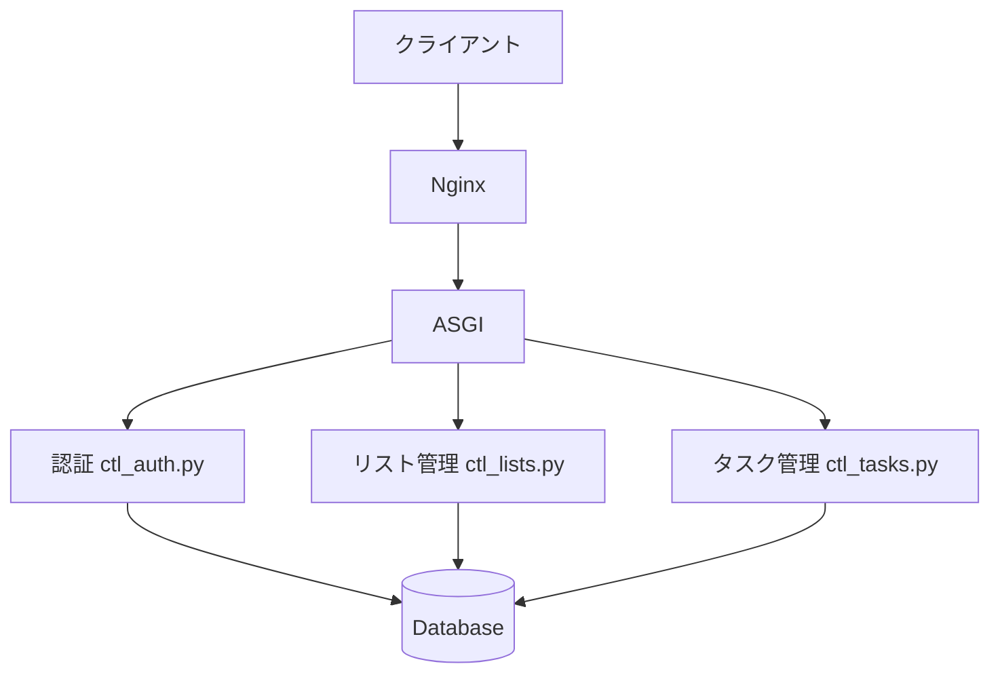

# システムパターン

## アーキテクチャ概要

## 主要コンポーネント

### バックエンド層

1. ASGI (asgi.py)
   - Quartアプリケーションのエントリーポイント
   - Flask互換のルーティング設定
   - 非同期ミドルウェア統合

2. コントローラー
   - ctl_auth.py: 認証・認可
   - ctl_lists.py: リスト管理
   - ctl_tasks.py: タスク管理
   - ctl_main.py: 共通機能

3. データベース層 (models/)
   - base.py: ベースクラスと共通定数
   - task.py: タスクモデル
   - list.py: リストモデル
   - user.py: ユーザーモデル
   - __init__.py: パッケージエクスポート
   - migrations/: Alembicマイグレーション

### フロントエンド層

1. テンプレート (templates/)
   - Jinja2テンプレートエンジン
   - _layout.html: 共通レイアウト
   - 各機能別テンプレート

2. 静的ファイル (static/)
   - ESモジュールベースのJavaScript
   - 標準DOM APIの活用
   - Bootstrap 5フレームワーク
   - PWA関連ファイル
   - アイコン・画像
   - ソースマップによるデバッグサポート

3. ビルドシステム
   - Viteによるモジュールバンドル
   - TypeScriptコンパイル
   - TailwindCSSによるスタイル処理
   - ソースマップ生成
   - 出力ディレクトリの整理（app/static/dist）
   - 最適化されたビルドフロー

## 設計パターン

1. MVCパターン
   - Model: models/
     - モジュール化された構造
     - 論理的な分離（ユーザー、リスト、タスク）
     - 共通機能の集約（base.py）
   - View: templates/
   - Controller: ctl_*.py

2. モジュールパターン（フロントエンド）
   - ESモジュールによる機能の分離
   - ユーティリティ関数の再利用
   - 暗号化処理のカプセル化

3. イベント委譲パターン
   - 標準DOMイベントの活用
   - バブリングを利用した効率的なイベントハンドリング
   - モダンなイベント処理パターン

4. サービスパターン
   - 各コントローラーでビジネスロジックを分離
   - helpers.py: 共通ユーティリティ
   - web_utils.py: Web関連ユーティリティ

5. マイグレーションパターン
   - Alembicによるバージョン管理
   - 前方/後方互換性の維持

## セキュリティパターン

1. 認証
   - セッションベース認証
   - パスワードハッシュ化
   - CSRF保護

2. アクセス制御
   - ルートレベルの認証チェック
   - リソースレベルの権限チェック

3. データ保護
   - AES-CBCによるデータ難読化（helpers.encrypt）
   - サーバー・クライアント間の双方向難読化
   - 共通暗号化キーとIVの集中管理

## テストパターン

1. ユニットテスト
   - 各コントローラーのテスト (*_test.py)
   - モデルのテスト
   - ユーティリティのテスト

2. 統合テスト
   - API エンドポイントテスト
   - データベース統合テスト

3. テスト環境
   - pytest
   - conftest.py: テスト用フィクスチャ
