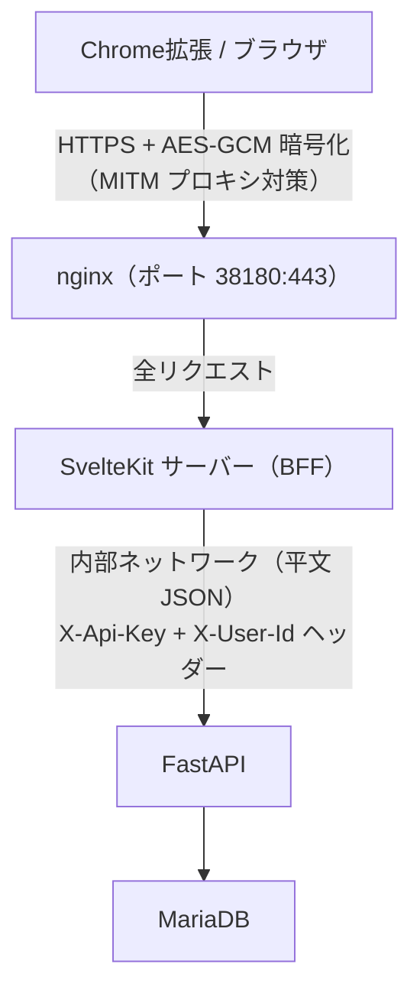
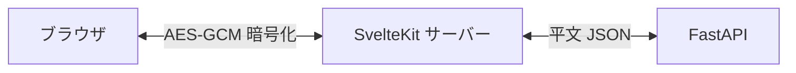

# アーキテクチャ

## 概要

Google Tasks の canvas ビューが廃止されたため自作した低機能 Web タスク管理アプリ。

## 現在のスタック

| レイヤー         | 技術               | 役割                                   |
|------------------|--------------------|----------------------------------------|
| フロントエンド   | SvelteKit          | UI・ルーティング・SSR・BFF             |
| バックエンド     | FastAPI            | REST API・ビジネスロジック             |
| ORM              | SQLAlchemy         | DB アクセス                            |
| DB               | MariaDB            | データ永続化                           |
| リバースプロキシ | nginx              | HTTPS 終端                             |
| CSS              | Tailwind CSS       | スタイリング                           |
| 暗号化           | Web Crypto API     | ブラウザ ↔ SvelteKit 間 AES-GCM       |
| 認証             | JWT/HS256 (`jose`) | Cookie セッション管理                  |

## アーキテクチャ図



## コンポーネント詳細

### FastAPI（バックエンド）

- 純粋な REST API サーバー（HTML 不返却・暗号化不要）
- 内部 API キー（`X-Api-Key`）+ ユーザー ID（`X-User-Id`）ヘッダーで認証
- Pydantic による入力バリデーション
- SQLAlchemy ORM で MariaDB にアクセス
- OpenAPI スキーマを `/openapi.json` で自動公開

### SvelteKit（フロントエンド / BFF）

- SSR で初期ページを生成
- `+layout.server.ts`: JWT 検証、暗号化鍵をブラウザに配布
- `src/routes/api/*`: ブラウザからの暗号化リクエストを復号し FastAPI に転送
- `src/lib/server/api.ts`: FastAPI への HTTP 呼び出し（サーバーサイドのみ）
- `src/lib/server/crypto.ts`: サーバー側 AES-GCM 暗号化・復号

## 暗号化設計

### 目的

諸事情（MITM プロキシなどでアプリケーション層のデータを盗み見られること）への対策。

### 方式

AES-GCM による対称暗号化。暗号化の範囲はブラウザ ↔ SvelteKit サーバー間のみ。



- **鍵管理**: `DATA_DIR/.encrypt_key`（32 バイト、初回起動時に自動生成）
- **鍵配布**: `+layout.server.ts` が `getEncryptKey()` を呼び出し Base64 でブラウザに渡す
- **クライアント実装**: `frontend/src/lib/crypto.ts`（Web Crypto API / AES-GCM）
- **サーバー実装**: `frontend/src/lib/server/crypto.ts`（Node.js WebCrypto）
- **データ形式**: `Base64(IV[12bytes] + CipherText)`

## 認証設計

### セッション方式

- Cookie ベースの JWT/HS256 署名セッション（`jose` ライブラリ）
- Cookie 名: `gla-session`、有効期限: 365 日
- 署名鍵: `DATA_DIR/.secret_key`（32 バイト、初回起動時に自動生成）
- `hooks.server.ts` で JWT 検証 → `locals.user_id` にセット
- パスワード: bcrypt ハッシュ（FastAPI 側で検証）

### CSRF 対策

- SvelteKit 組み込みの `checkOrigin` が form action を保護
- `hooks.server.ts` で `Sec-Fetch-Site: cross-site` + ミューテーション（POST/PATCH/PUT/DELETE）を `/api/*` でブロック
- ログアウトは POST のみ受け付ける

### Chrome 拡張対応

Chrome 拡張のポップアップ内 iframe からのアクセスを許可するため:

- `sameSite: "none"`
- `secure: true`

## ディレクトリ構造

```text
/
├── app/                # FastAPI バックエンド（Python）
│   ├── models/         # SQLAlchemy モデル
│   ├── views/          # FastAPI ルーター
│   ├── migrations/     # Alembic マイグレーション
│   ├── asgi.py         # アプリケーションエントリポイント
│   ├── config.py       # 設定
│   └── helpers.py      # ユーティリティ
├── frontend/           # SvelteKit フロントエンド（BFF）
│   ├── src/
│   │   ├── hooks.server.ts
│   │   ├── lib/
│   │   │   ├── cache.ts          # IndexedDB キャッシュ
│   │   │   ├── crypto.ts         # ブラウザ側暗号化
│   │   │   └── server/           # サーバーサイド専用
│   │   │       ├── api.ts        # FastAPI 呼び出し
│   │   │       ├── crypto.ts     # サーバー側暗号化
│   │   │       └── session.ts    # JWT 生成・検証
│   │   └── routes/               # ページ・API エンドポイント
│   └── tests/                    # Playwright e2e テスト
├── chrome_extension/   # Chrome 拡張機能
├── web/                # nginx 設定・SSL 証明書
├── docs/               # ドキュメント
└── db/                 # DB 設定
```
