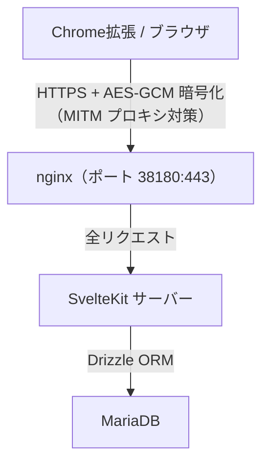
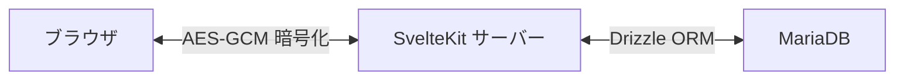

# アーキテクチャ

## 概要

Google Tasks の canvas ビューが廃止されたため自作した低機能 Web タスク管理アプリ。

## スタック

| レイヤー         | 技術                  | 役割                                    |
| ---------------- | --------------------- | --------------------------------------- |
| アプリケーション | SvelteKit             | UI・ルーティング・SSR・API・DB アクセス |
| API              | tRPC v11              | 型安全な RPC（暗号化ミドルウェア付き）  |
| バリデーション   | Zod                   | スキーマバリデーション                  |
| データ取得       | TanStack Svelte Query | クライアント側キャッシュ・状態管理      |
| ORM              | Drizzle ORM           | DB アクセス（型安全）                   |
| DB               | MariaDB               | データ永続化                            |
| リバースプロキシ | nginx                 | HTTPS 終端                              |
| CSS              | Tailwind CSS          | スタイリング                            |
| 暗号化           | Web Crypto API        | ブラウザ ↔ SvelteKit 間 AES-GCM         |
| 認証             | JWT/HS256 (`jose`)    | Cookie セッション管理                   |

## アーキテクチャ図



## コンポーネント詳細

### SvelteKit（アプリケーション）

- SSR で初期ページを生成
- `+layout.server.ts`: JWT 検証、暗号化鍵をブラウザに配布
- `src/routes/api/trpc/[...trpc]/+server.ts`: tRPC エンドポイント（暗号化ミドルウェアで自動復号・暗号化）
- `src/lib/server/trpc.ts`: tRPC ルーター定義・暗号化ミドルウェア
- `src/lib/server/api.ts`: Drizzle ORM によるビジネスロジック
- `src/lib/server/schema.ts`: Drizzle テーブルスキーマ定義
- `src/lib/server/db.ts`: DB 接続プール管理
- `src/lib/server/crypto.ts`: サーバー側 AES-GCM 暗号化・復号
- `src/lib/server/env.ts`: 環境変数・暗号化鍵管理
- `src/lib/trpc.ts`: tRPC クライアント（暗号化リンク）
- `src/lib/schemas.ts`: Zod バリデーションスキーマ
- `src/lib/query-client.ts`: TanStack Query 設定 + IndexedDB 永続化

## 暗号化設計

### 目的

HTTPS通信で通信経路は暗号化されるが、それに加えてアプリケーション側でMITMプロキシ対策のための難読化を行う。(諸事情により必須)

キーも一緒に送るので暗号化だけど実質ただの難読化。

### 方式

AES-GCM による対称暗号化。難読化の範囲はブラウザ ↔ SvelteKit サーバー間のみ。



- **鍵管理**: `DATA_DIR/.encrypt_key`（32 バイト、初回起動時に自動生成）
- **鍵配布**: `+layout.server.ts` が `getEncryptKey()` を呼び出し Base64 でブラウザに渡す
- **クライアント実装**: `app/src/lib/crypto.ts`（Web Crypto API / AES-GCM）
- **サーバー実装**: `app/src/lib/server/crypto.ts`（Node.js WebCrypto）
- **データ形式**: `Base64(IV[12bytes] + CipherText)`

## 認証設計

### セッション方式

- Cookie ベースの JWT/HS256 署名セッション（`jose` ライブラリ）
- Cookie 名: `gla-session`、有効期限: 365 日
- 署名鍵: `DATA_DIR/.secret_key`（32 バイト、初回起動時に自動生成）
- `hooks.server.ts` で JWT 検証 → `locals.user_id` にセット
- パスワード: bcrypt ハッシュ（`bcryptjs` で検証）

### CSRF 対策

- SvelteKit 組み込みの `checkOrigin` が form action を保護
- `hooks.server.ts` で `Sec-Fetch-Site: cross-site` + ミューテーション（POST/PATCH/PUT/DELETE）を `/api/*` でブロック
- ログアウトは POST のみ受け付ける

### Chrome 拡張対応

Chrome 拡張のポップアップ内 iframe からのアクセスを許可するため:

- `sameSite: "none"`
- `secure: true`

## DB スキーマ

3テーブル構成。日時カラムはすべて TIMESTAMP 型で UTC 保存。

### user

| カラム     | 型                 | 説明                             |
| ---------- | ------------------ | -------------------------------- |
| id         | INT PK             | 内部 ID                          |
| user       | VARCHAR(80) UNIQUE | ログイン ID（英数字 4〜32 文字） |
| pass_hash  | VARCHAR(255)       | bcrypt ハッシュ                  |
| joined     | TIMESTAMP          | 登録日時（UTC）                  |
| last_login | TIMESTAMP NULL     | 最終ログイン日時（UTC）          |

### list

| カラム       | 型           | 説明                                               |
| ------------ | ------------ | -------------------------------------------------- |
| id           | INT PK       | 内部 ID                                            |
| user_id      | INT FK→user  | 所有ユーザー                                       |
| status       | VARCHAR(255) | `show` / `hidden` / `active`（デフォルト: `show`） |
| title        | VARCHAR(255) | リスト名                                           |
| last_updated | TIMESTAMP    | 最終更新日時（UTC）                                |

### task

| カラム    | 型             | 説明                                                  |
| --------- | -------------- | ----------------------------------------------------- |
| id        | INT PK         | 内部 ID                                               |
| list_id   | INT FK→list    | 所属リスト                                            |
| status_id | INT            | 0=needsAction, 1=completed, 2=hidden（デフォルト: 0） |
| text      | TEXT           | 内容（1行目=タイトル, 2行目以降=メモ）                |
| created   | TIMESTAMP      | 作成日時（UTC）                                       |
| updated   | TIMESTAMP      | 更新日時（UTC、並び順に使用、降順）                   |
| completed | TIMESTAMP NULL | 完了日時（UTC）                                       |

## ディレクトリ構造

```text
/
├── package.json          # 依存関係管理（ルートに統一）
├── eslint.config.js      # ESLint 設定（app + chrome_extension）
├── playwright.config.ts  # Playwright e2e テスト設定
├── vitest.config.ts      # Vitest ユニットテスト設定
├── drizzle.config.ts     # Drizzle ORM マイグレーション設定
├── tsconfig.json         # TypeScript 設定
├── Dockerfile            # 本番用マルチステージビルド
├── compose.yaml          # Docker Compose 基本設定
├── app/                  # SvelteKit アプリケーション
│   ├── svelte.config.js
│   ├── vite.config.ts
│   ├── src/
│   │   ├── hooks.server.ts
│   │   ├── lib/
│   │   │   ├── crypto.ts         # ブラウザ側暗号化
│   │   │   ├── trpc.ts           # tRPC クライアント（暗号化リンク）
│   │   │   ├── schemas.ts        # Zod バリデーションスキーマ
│   │   │   ├── query-client.ts   # TanStack Query 設定
│   │   │   ├── components/       # Svelte コンポーネント
│   │   │   │   ├── layout/       #   Header
│   │   │   │   ├── lists/        #   ListItem, ListSidebar
│   │   │   │   └── tasks/        #   TaskItem, TaskList, TaskAddForm, TaskEditDialog
│   │   │   └── server/           # サーバーサイド専用
│   │   │       ├── api.ts        # ビジネスロジック（Drizzle ORM）
│   │   │       ├── trpc.ts       # tRPC ルーター・暗号化ミドルウェア
│   │   │       ├── crypto.ts     # サーバー側暗号化
│   │   │       ├── db.ts         # DB 接続プール管理
│   │   │       ├── env.ts        # 環境変数・暗号化鍵管理
│   │   │       ├── schema.ts     # Drizzle テーブルスキーマ定義
│   │   │       └── session.ts    # JWT 生成・検証
│   │   └── routes/               # ページ・API エンドポイント
│   └── tests/                    # Playwright e2e テスト
├── drizzle/              # Drizzle ORM マイグレーション
├── chrome_extension/     # Chrome 拡張機能
├── web/                  # nginx 設定・SSL 証明書
├── docs/                 # ドキュメント
└── db/                   # DB 設定
```
