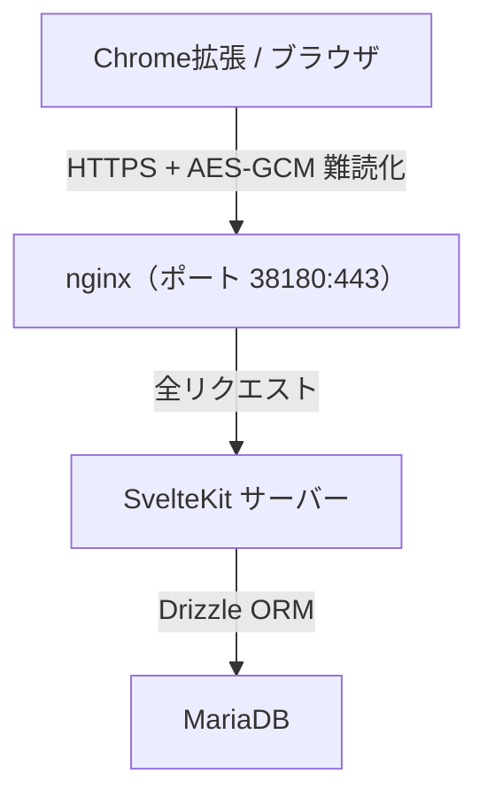
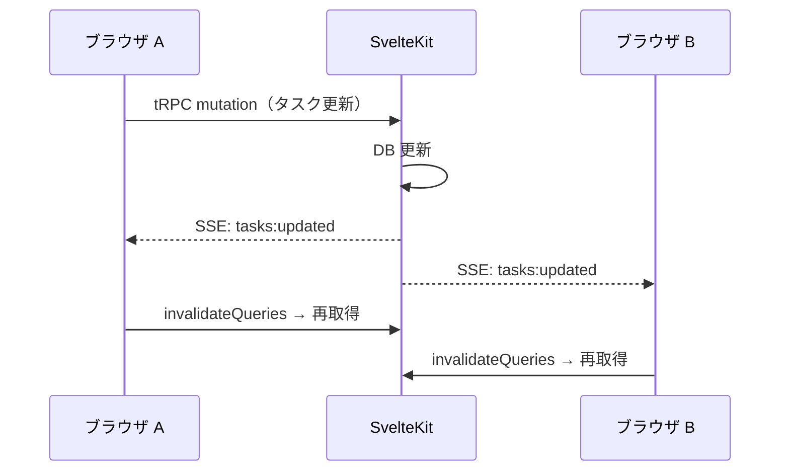

# アーキテクチャ

## 概要

タスク管理＆カウントダウンタイマーアプリ。

## スタック

| レイヤー         | 技術                  | 役割                                    |
| ---------------- | --------------------- | --------------------------------------- |
| アプリケーション | SvelteKit             | UI・ルーティング・SSR・API・DB アクセス |
| API              | tRPC v11              | 型安全な RPC（難読化ミドルウェア付き）  |
| バリデーション   | Zod                   | スキーマバリデーション                  |
| データ取得       | TanStack Svelte Query | クライアント側キャッシュ・状態管理      |
| ORM              | Drizzle ORM           | DB アクセス（型安全）                   |
| DB               | MariaDB               | データ永続化                            |
| リバースプロキシ | nginx                 | HTTPS 終端                              |
| CSS              | Tailwind CSS          | スタイリング                            |
| 難読化           | Web Crypto API        | ブラウザ ↔ SvelteKit 間 AES-GCM         |
| 認証             | JWT/HS256 (`jose`)    | Cookie セッション管理                   |

## アーキテクチャ図（Docker Compose 内部構成）


```mermaid
flowchart TB
    Browser["Chrome拡張 / ブラウザ"]
    Nginx["nginx（ポート 38180:443）"]
    SK["SvelteKit サーバー"]
    DB["MariaDB"]

    Browser -- "HTTPS + AES-GCM 難読化" --> Nginx
    Nginx -- "全リクエスト" --> SK
    SK -- "Drizzle ORM" --> DB
```

## リアルタイム同期（SSE）

mutation 完了時に SSE (Server-Sent Events) で他タブ・他端末へ即座に通知する。


```mermaid
sequenceDiagram
    participant A as ブラウザ A
    participant S as SvelteKit
    participant B as ブラウザ B

    A->>S: tRPC mutation（タスク更新）
    S->>S: DB 更新
    S-->>A: SSE: tasks:updated
    S-->>B: SSE: tasks:updated
    A->>S: invalidateQueries → 再取得
    B->>S: invalidateQueries → 再取得
```

- エンドポイント: `GET /api/events`（Cookie 認証）
- データは含めずイベント種別のみ送信（`lists:updated` / `tasks:updated` / `timers:updated`）
- クライアントはイベント受信時に TanStack Query の `invalidateQueries` で該当データを再取得
- 再接続はブラウザの `EventSource` 自動再接続に委ねる
- nginx: `/api/events` に `proxy_buffering off` を設定（SSE がバッファされると配信遅延が発生するため）

## タイマー時刻同期

タイマーの残り時間をブラウザで正確に計算するため、サーバーとの時刻差（オフセット）を管理する。

### オフセット計算

tRPC レスポンスで RTT/2 補正付きの精密なオフセットを計算する:

```text
offset = serverTime - (requestStart + requestEnd) / 2
```

### オフセット更新の流れ

```text
SSE connected (初回接続)  ──→ setServerOffset(暫定値)
tRPC response (1分間隔)   ──→ setServerOffset(RTT/2補正値)
tRPC response (SSEイベント後) → setServerOffset(RTT/2補正値)
SSE heartbeat (30秒ごと)  ──→ 接続維持のみ（オフセット更新なし）
```

SSE は片道通信のため RTT を測定できない。heartbeat のサーバー時刻でオフセットを上書きすると、tRPC の RTT/2 補正で得た精密値が片道遅延分だけズレた値に劣化するため、heartbeat は接続維持のみに使用する。

## 認証設計

### セッション方式

- Cookie ベースの JWT/HS256 署名セッション（`jose` ライブラリ）
- Cookie 名: `gla-session`、有効期限: 365 日
- 署名鍵: `DATA_DIR/.secret_key`（32 バイト、初回起動時に自動生成）
- `hooks.server.ts` で JWT 検証 → `locals.user_id` にセット
- パスワード: bcrypt ハッシュ（`bcryptjs` で検証）

### CSRF 対策

- SvelteKit 組み込みの `checkOrigin` が form action を保護
- `hooks.server.ts` で `Sec-Fetch-Site: cross-site` + ミューテーション（POST/PATCH/PUT/DELETE）を `/api/*` でブロック
- ログアウトは POST のみ受け付ける

### Chrome 拡張対応

Chrome 拡張のポップアップ内 iframe からのアクセスを許可するため:

- `sameSite: "none"`
- `secure: true`

## DB スキーマ

4テーブル構成。カラム詳細は `app/src/lib/server/schema.ts` を参照。

| テーブル | 役割                                                                          |
| -------- | ----------------------------------------------------------------------------- |
| `user`   | ユーザー認証情報（bcrypt ハッシュ）                                           |
| `list`   | タスクリスト（`active` / `archived`）                                         |
| `task`   | タスク（`active` / `completed` / `archived`、1行目=タイトル, 2行目以降=メモ） |
| `timer`  | カウントダウンタイマー                                                        |

設計上の注意点:

- 日時カラムはすべて TIMESTAMP 型で UTC 保存
- 並び順は `sort_order` INT カラム（昇順、1000 刻み）
- タイマーの残り時間計算: `running=0` → `remaining_seconds` をそのまま表示、`running=1` → `remaining_seconds - (現在時刻 - started_at)秒` で計算（サーバー時刻オフセット補正あり）
