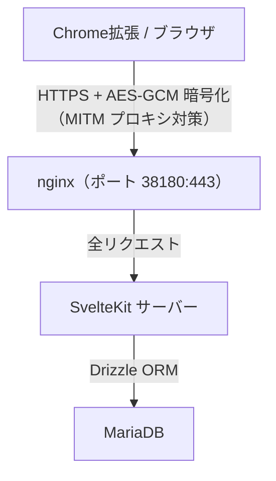
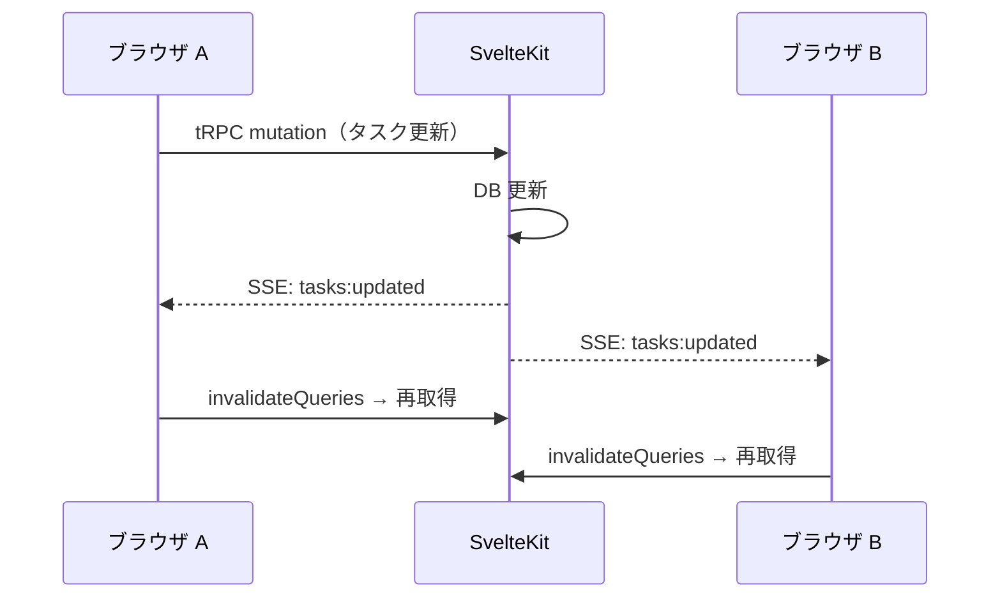

# アーキテクチャ

## 概要

タスク管理＆カウントダウンタイマーアプリ。

## スタック

| レイヤー         | 技術                  | 役割                                    |
| ---------------- | --------------------- | --------------------------------------- |
| アプリケーション | SvelteKit             | UI・ルーティング・SSR・API・DB アクセス |
| API              | tRPC v11              | 型安全な RPC（難読化ミドルウェア付き）  |
| バリデーション   | Zod                   | スキーマバリデーション                  |
| データ取得       | TanStack Svelte Query | クライアント側キャッシュ・状態管理      |
| ORM              | Drizzle ORM           | DB アクセス（型安全）                   |
| DB               | MariaDB               | データ永続化                            |
| リバースプロキシ | nginx                 | HTTPS 終端                              |
| CSS              | Tailwind CSS          | スタイリング                            |
| 難読化           | Web Crypto API        | ブラウザ ↔ SvelteKit 間 AES-GCM         |
| 認証             | JWT/HS256 (`jose`)    | Cookie セッション管理                   |

## アーキテクチャ図


```mermaid
flowchart TB
    Browser["Chrome拡張 / ブラウザ"]
    Nginx["nginx（ポート 38180:443）"]
    SK["SvelteKit サーバー"]
    DB["MariaDB"]

    Browser -- "HTTPS + AES-GCM 暗号化（MITM プロキシ対策）" --> Nginx
    Nginx -- "全リクエスト" --> SK
    SK -- "Drizzle ORM" --> DB
```

## コンポーネント詳細

### SvelteKit（アプリケーション）

- SSR で初期ページを生成
- `+layout.server.ts`: JWT 検証、暗号化鍵をブラウザに配布
- `src/routes/api/trpc/[...trpc]/+server.ts`: tRPC エンドポイント（暗号化ミドルウェアで自動復号・暗号化）
- `src/lib/server/trpc.ts`: tRPC ルーター定義・暗号化ミドルウェア
- `src/lib/server/api.ts`: Drizzle ORM によるビジネスロジック
- `src/lib/server/schema.ts`: Drizzle テーブルスキーマ定義
- `src/lib/server/db.ts`: DB 接続プール管理
- `src/lib/server/crypto.ts`: サーバー側 AES-GCM 暗号化・復号
- `src/lib/server/env.ts`: 環境変数・暗号化鍵管理
- `src/lib/trpc.ts`: tRPC クライアント（暗号化リンク）
- `src/lib/schemas.ts`: Zod バリデーションスキーマ
- `src/lib/query-client.ts`: TanStack Query 設定 + IndexedDB 永続化

## リアルタイム同期（SSE）

mutation 完了時に SSE (Server-Sent Events) で他タブ・他端末へ即座に通知する。


```mermaid
sequenceDiagram
    participant A as ブラウザ A
    participant S as SvelteKit
    participant B as ブラウザ B

    A->>S: tRPC mutation（タスク更新）
    S->>S: DB 更新
    S-->>A: SSE: tasks:updated
    S-->>B: SSE: tasks:updated
    A->>S: invalidateQueries → 再取得
    B->>S: invalidateQueries → 再取得
```

- エンドポイント: `GET /api/events`（Cookie 認証）
- データは含めずイベント種別のみ送信（`lists:updated` / `tasks:updated` / `timers:updated`）
- クライアントはイベント受信時に TanStack Query の `invalidateQueries` で該当データを再取得
- 再接続はブラウザの `EventSource` 自動再接続に委ねる
- nginx: `/api/events` に `proxy_buffering off` を設定（SSE がバッファされると配信遅延が発生するため）
- 実装: `src/lib/server/sse.ts`（接続管理）、`src/routes/api/events/+server.ts`（エンドポイント）

## UX 機能

### キーボードショートカット

タスクページで以下のショートカットが使用可能（input/textarea/select にフォーカス中、またはダイアログ表示中は無効）:

- `n`: タスク追加テキストエリアにフォーカス
- `/`: 検索入力欄にフォーカス
- `Escape`: アクティブ要素のフォーカスを外す

### 全文検索

ヘッダーの検索欄からユーザーの全アクティブリストのタスクを横断 LIKE 検索する。300ms デバウンス付き。検索結果はリスト名でグループ化して表示し、クリックで該当リストに遷移する。

### ドラッグ&ドロップ並び替え

HTML5 Drag API でタスクの並び替えが可能。ドロップ時に楽観的更新（`queryClient.setQueryData`）で即座にUIに反映し、サーバーと非同期で同期する。リストはタイトルの名前順でソートされる。

### ダークモード

Tailwind CSS v4 の `@custom-variant dark` で実装。light / dark / system の3状態トグル。テーマ設定は `localStorage` に保存し、FOUC 防止のため `app.html` のインラインスクリプトで初期適用する。色マッピングの詳細は [docs/coding-style.md](coding-style.md) を参照。

実装: `app/src/lib/theme.ts`

## 認証設計

### セッション方式

- Cookie ベースの JWT/HS256 署名セッション（`jose` ライブラリ）
- Cookie 名: `gla-session`、有効期限: 365 日
- 署名鍵: `DATA_DIR/.secret_key`（32 バイト、初回起動時に自動生成）
- `hooks.server.ts` で JWT 検証 → `locals.user_id` にセット
- パスワード: bcrypt ハッシュ（`bcryptjs` で検証）

### CSRF 対策

- SvelteKit 組み込みの `checkOrigin` が form action を保護
- `hooks.server.ts` で `Sec-Fetch-Site: cross-site` + ミューテーション（POST/PATCH/PUT/DELETE）を `/api/*` でブロック
- ログアウトは POST のみ受け付ける

### Chrome 拡張対応

Chrome 拡張のポップアップ内 iframe からのアクセスを許可するため:

- `sameSite: "none"`
- `secure: true`

## DB スキーマ

4テーブル構成。日時カラムはすべて TIMESTAMP 型で UTC 保存。

### user

| カラム     | 型                 | 説明                             |
| ---------- | ------------------ | -------------------------------- |
| id         | INT PK             | 内部 ID                          |
| user       | VARCHAR(80) UNIQUE | ログイン ID（英数字 4〜32 文字） |
| pass_hash  | VARCHAR(255)       | bcrypt ハッシュ                  |
| joined     | TIMESTAMP          | 登録日時（UTC）                  |
| last_login | TIMESTAMP NULL     | 最終ログイン日時（UTC）          |

### list

| カラム       | 型           | 説明                                          |
| ------------ | ------------ | --------------------------------------------- |
| id           | INT PK       | 内部 ID                                       |
| user_id      | INT FK→user  | 所有ユーザー                                  |
| status       | VARCHAR(255) | `active` / `archived`（デフォルト: `active`） |
| title        | VARCHAR(255) | リスト名                                      |
| sort_order   | INT          | 表示順（昇順、デフォルト: 0、1000 刻み）      |
| last_updated | TIMESTAMP    | 最終更新日時（UTC）                           |

### task

| カラム     | 型             | 説明                                                        |
| ---------- | -------------- | ----------------------------------------------------------- |
| id         | INT PK         | 内部 ID                                                     |
| list_id    | INT FK→list    | 所属リスト                                                  |
| status     | VARCHAR(255)   | `active` / `completed` / `archived`（デフォルト: `active`） |
| text       | TEXT           | 内容（1行目=タイトル, 2行目以降=メモ）                      |
| sort_order | INT            | 表示順（昇順、デフォルト: 0、1000 刻み）                    |
| created    | TIMESTAMP      | 作成日時（UTC）                                             |
| updated    | TIMESTAMP      | 更新日時（UTC）                                             |
| completed  | TIMESTAMP NULL | 完了日時（UTC）                                             |

### timer

| カラム            | 型             | 説明                                       |
| ----------------- | -------------- | ------------------------------------------ |
| id                | INT PK         | 内部 ID                                    |
| user_id           | INT FK→user    | 所有ユーザー                               |
| name              | VARCHAR(255)   | タイマー名                                 |
| base_seconds      | INT            | ベース時間（秒）                           |
| adjust_minutes    | INT            | 延長/削減のデフォルト分数（デフォルト: 5） |
| running           | TINYINT(1)     | 動作中フラグ（デフォルト: 0）              |
| remaining_seconds | INT            | 残り秒数                                   |
| started_at        | TIMESTAMP NULL | 動作開始時刻（running=1 の時のみ有効）     |
| sort_order        | INT            | 表示順（デフォルト: 0）                    |
| created           | TIMESTAMP      | 作成日時（UTC）                            |
| updated           | TIMESTAMP      | 最終更新日時（UTC）                        |

残り時間の計算:

- `running=0` → `remaining_seconds` をそのまま表示
- `running=1` → `remaining_seconds - (現在時刻 - started_at)秒` で計算（ローカル時計 + サーバー時刻オフセット補正）

## ディレクトリ構造

```text
/
├── package.json          # 依存関係管理（ルートに統一）
├── eslint.config.js      # ESLint 設定（app + chrome_extension）
├── playwright.config.ts  # Playwright e2e テスト設定
├── vitest.config.ts      # Vitest ユニットテスト設定
├── drizzle.config.ts     # Drizzle ORM マイグレーション設定
├── tsconfig.json         # TypeScript 設定
├── Dockerfile            # 本番用マルチステージビルド
├── compose.yaml          # Docker Compose 基本設定
├── app/                  # SvelteKit アプリケーション
│   ├── svelte.config.js
│   ├── vite.config.ts
│   ├── src/
│   │   ├── hooks.server.ts
│   │   ├── lib/
│   │   │   ├── crypto.ts         # ブラウザ側暗号化
│   │   │   ├── trpc.ts           # tRPC クライアント（暗号化リンク）
│   │   │   ├── schemas.ts        # Zod バリデーションスキーマ
│   │   │   ├── query-client.ts   # TanStack Query 設定
│   │   │   ├── beep.ts           # Web Audio API ビープ音（タイマー完了通知）
│   │   │   ├── theme.ts          # ダークモード テーマ管理
│   │   │   ├── types.ts           # 共通型定義
│   │   │   ├── components/       # Svelte コンポーネント
│   │   │   │   ├── layout/       #   Header, AuthCard
│   │   │   │   ├── lists/        #   ListItem, ListSidebar
│   │   │   │   ├── tasks/        #   TaskItem, TaskList, TaskListHeader, TaskAddForm, TaskEditDialog
│   │   │   │   └── timers/       #   TimerCard, TimerCreateDialog, TimerAlarmMonitor
│   │   │   └── server/           # サーバーサイド専用
│   │   │       ├── api.ts        # ビジネスロジック（Drizzle ORM）
│   │   │       ├── trpc.ts       # tRPC ルーター・暗号化ミドルウェア
│   │   │       ├── crypto.ts     # サーバー側暗号化
│   │   │       ├── db.ts         # DB 接続プール管理
│   │   │       ├── env.ts        # 環境変数・暗号化鍵管理
│   │   │       ├── schema.ts     # Drizzle テーブルスキーマ定義
│   │   │       ├── session.ts    # JWT 生成・検証
│   │   │       └── sse.ts        # SSE 接続管理・イベント配信
│   │   └── routes/               # ページ・API エンドポイント
│   └── tests/                    # Playwright e2e テスト
├── drizzle/              # Drizzle ORM マイグレーション
├── chrome_extension/     # Chrome 拡張機能
├── web/                  # nginx 設定・SSL 証明書
├── docs/                 # ドキュメント
└── db/                   # DB 設定
```
