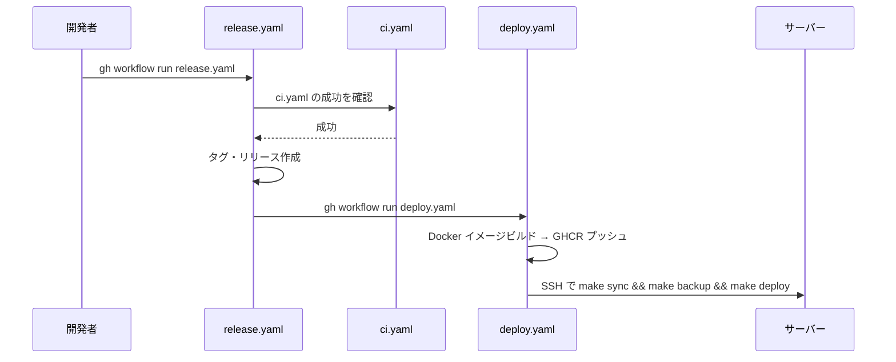

# 開発手順

## 作業ディレクトリ

**すべての `make` コマンドはプロジェクトルートから実行すること。**

```bash
cd /path/to/glatasks
make test  # OK
```

`app/` に移動して実行すると `${PWD}` がずれて Makefile 内のパス解決が狂うため、必ずルートから実行する。

## 開発環境の構築手順

1. 本リポジトリをcloneする。
2. [pre-commit](https://pre-commit.com/)フックをインストールする。

   ```bash
   pre-commit install
   ```

3. 起動する。

   ```bash
   make deploy
   ```

## make コマンド

`make help` で一覧を確認できる。よく使うコマンド:

- `make format` — コード編集後に実行。整形 + 自動修正付き lint
- `make test` — コミット前に実行。format + 型チェック + ユニットテスト + e2e の全検証
- `make deploy` — ビルド → 停止 → 起動

## Docker 構成

サービス構成・環境変数は `compose.yaml` / `.env` を参照。

## 開発環境での動作確認

開発環境はすべて Docker Compose 上で動作する。ホストから直接 `localhost:3000` にアクセスできない場合がある。

nginx 経由で確認:

```bash
curl -k https://localhost:38180/healthcheck
```

app コンテナ経由で確認:

```bash
docker compose exec app curl --fail http://localhost:3000/healthcheck
```

`make healthcheck` はホスト直接→コンテナ経由の順にフォールバックして確認する。

## ユニットテスト

Vitest を使ったユニットテストは `make node-shell` でコンテナに入り、`pnpm exec vitest run` で実行できる。

```bash
make node-shell
pnpm exec vitest run
```

`make test` を実行すると型チェック + ユニットテスト + e2e がまとめて実行される（lint は `make format` で実行済み）。

テストコードは `app/src/` 配下に `*.test.ts` として配置する（例: `app/src/lib/crypto.test.ts`）。

## e2e テスト

Playwright を使った e2e テストを `make test-e2e` で実行できる。

```bash
make test-e2e
```

テストコードは `app/tests/` に配置する。
nginx 経由の HTTPS（port 38180）でテストするため、開発環境が起動している必要がある。
テストユーザーは `app/tests/global-setup.ts` で初回自動作成される。

### Playwright テスト実装の注意点

- **SvelteKit の hydration 完了を待つ**: `waitForSelector` はSSRで描画されるため即返るが、`onMount` の API 呼び出しはまだ完了していない。SSE 接続が常時開いているため `waitUntil: "networkidle"` は使えない。`Promise.all([page.goto(url), page.waitForResponse(res => res.url().includes("/api/trpc"))])` パターンを使うこと。
- **`browser.newContext()` を使う場合は `baseURL` を明示する**: `page.goto("/")` が動くよう `baseURL` を指定すること。
- **セレクタの曖昧さに注意**: `button:has-text("追加")` はサイドバーのリスト追加ボタンにも一致する。`main button:has-text("追加")` のようにスコープを限定すること。

### テスト設計の思想

`make format` と `make test` の2パターンを基本とする。

- `make format`: 軽量な整形+lint。コード編集後に気軽に実行する用途。pre-commit hooks（prettier, eslint --fix, markdownlint, textlint）を実行
- `make test`: 全テスト。コミット前に実行する用途。format → 型チェック → ユニットテスト → バックアップテスト → e2eテスト。format で eslint --fix 済みのため lint チェックは省略
- CI（`pnpm run test`）: lint + 型チェック + ユニットテスト。CI では format が先行しないため lint を含む

## 開発時の注意点

- JSON ボディから受け取る数値は文字列の場合があるため `Number()` で明示変換すること（`"5" !== 5` の型不一致を防ぐ）
- 日時は全レイヤーで UTC 統一。DB（TIMESTAMP 型）→ サーバー（Date オブジェクト）→ クライアント（ISO8601 文字列）の変換は自動で行われるため、タイムゾーンを意識するコードは不要

## CI/CD

### CI（ci.yaml）

master への push・PR 時に自動実行。lint + 型チェック + ユニットテスト（`pnpm run test`）を実行する。CI では `make format` が先行しないため、`pnpm run test` に lint を含めている。e2e テストは CI では実行しない（Docker Compose 環境が必要なため）。

### リリース→デプロイの流れ



1. `release.yaml`（手動実行）: master の ci.yaml が成功していることを確認 → バージョンタグとリリースを作成 → `gh workflow run deploy.yaml` でデプロイを起動
2. `deploy.yaml`（release.yaml から起動）: Docker イメージをビルドして GHCR にプッシュ → SSH でサーバーに接続し `make sync && make backup && make deploy` を実行

## GitHub Actionsのデプロイ用SSHキー作成手順

鍵ペアを作成、サーバーに登録:

```bash
ssh-keygen -t ed25519 -C "github-action@GLATasks" -f github_action
ssh-copy-id -i github_action.pub ubuntu@aws.tqzh.tk
```

GitHub に秘密鍵を登録:

- リポジトリ → Settings → Secrets and variables → Actions → New repository secret
  - Name: `SSH_PRIVATE_KEY`
  - Value: `cat github_action` の出力

後始末:

```bash
\rm github_action github_action.pub
```

## バックアップとリストア

### バックアップ

デプロイ前に DB ダンプとキーファイルのバックアップを取得する。CIデプロイ（deploy.yaml）では `make deploy` の前に自動実行される。

```bash
make backup
```

バックアップ先: `${DATA_DIR}/backups/YYYYMMDD_HHMMSS/`（DB ダンプ + キーファイル）

デフォルトで直近5世代を保持する。`BACKUP_KEEP` 環境変数で変更可能:

```bash
BACKUP_KEEP=10 make backup
```

DB コンテナが停止中の場合はエラー終了する。初回デプロイなど DB がない状態では `SKIP_DB_DUMP=1` でスキップ可能:

```bash
SKIP_DB_DUMP=1 make backup
```

### リストア

```bash
# DB 復元
docker compose exec -T db mariadb -uglatasks -pglatasks glatasks < ${DATA_DIR}/backups/YYYYMMDD_HHMMSS/glatasks.sql

# キーファイル復元
cp -p ${DATA_DIR}/backups/YYYYMMDD_HHMMSS/.encrypt_key ${DATA_DIR}/
cp -p ${DATA_DIR}/backups/YYYYMMDD_HHMMSS/.secret_key ${DATA_DIR}/

# app 再起動（キーファイルを反映）
make restart-app
```

## リリース手順

事前に`gh`コマンドをインストールして`gh auth login`でログインしておき、以下のコマンドのいずれかを実行。

```bash
gh workflow run release.yaml --field="bump=バグフィックス"
gh workflow run release.yaml --field="bump=マイナーバージョンアップ"
gh workflow run release.yaml --field="bump=メジャーバージョンアップ"
```

<https://github.com/ak110/GLATasks/actions> で状況を確認できる。

リリース作成後、deploy.yaml が自動的にトリガーされ本番デプロイが実行される。詳細は [CI/CD](#cicd) セクションを参照。
