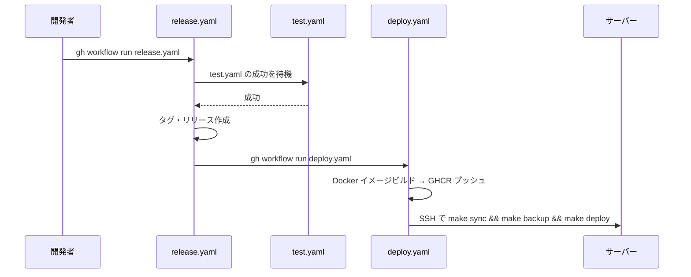

# 開発手順

## 作業ディレクトリ

**すべての `make` コマンドはプロジェクトルートから実行すること。**

```bash
cd /path/to/glatasks
make test  # OK
```

`app/` に移動して実行すると `${PWD}` がずれて Makefile 内のパス解決が狂うため、必ずルートから実行する。

## 開発環境の構築手順

1. 本リポジトリをcloneする。
2. [pre-commit](https://pre-commit.com/)フックをインストールする。

   ```bash
   pre-commit install
   ```

3. 起動する。

   ```bash
   make deploy
   ```

## make コマンド一覧

| コマンド                      | 説明                                                                        |
| ----------------------------- | --------------------------------------------------------------------------- |
| `make help`                   | Makefile の内容を表示                                                       |
| `make sync`                   | 最新化（docker pull + git fetch + rebase）                                  |
| `make deploy`                 | ビルド → 停止 → 起動                                                        |
| `make build`                  | Docker イメージビルド                                                       |
| `make start` / `make stop`    | 起動 / 停止                                                                 |
| `make restart-app`            | app コンテナのみ再起動                                                      |
| `make start-app`              | app コンテナの停止 → 起動                                                   |
| `make format`                 | コード整形 + 軽量 lint（自動修正あり）                                      |
| `make backup`                 | デプロイ前バックアップ（DB + キーファイル）                                 |
| `make test`                   | format + 型チェック + unit test + backup test + e2e（これだけ実行すればOK） |
| `make test-backup`            | バックアップ機能のテスト                                                    |
| `make test-e2e`               | Playwright e2e テストのみ                                                   |
| `make update`                 | 依存パッケージ更新 + テスト                                                 |
| `make migrate`                | DB マイグレーション実行                                                     |
| `make db-studio`              | Drizzle Studio 起動                                                         |
| `make sql`                    | MariaDB コンソール                                                          |
| `make shell`                  | app コンテナの bash シェル                                                  |
| `make node-shell`             | Node コンテナでの作業用シェル                                               |
| `make logs` / `make logs-app` | 全サービス / app のみのログ                                                 |
| `make ps`                     | コンテナ状態確認                                                            |
| `make healthcheck`            | ヘルスチェック                                                              |

## Docker サービス構成

| サービス | イメージ                          | 役割                                      |
| -------- | --------------------------------- | ----------------------------------------- |
| `web`    | nginx                             | HTTPS 終端（ポート 38180:443）            |
| `app`    | node:lts（開発）/ ghcr.io（本番） | SvelteKit アプリケーション（ポート 3000） |
| `db`     | mariadb:lts                       | データベース                              |

環境変数:

- `COMPOSE_PROFILE`: `development` / `staging` / `production`
- `DATA_DIR`: データ格納ディレクトリ（暗号化キー・JWT 署名鍵・DB データ）
- `DATABASE_URL`: MariaDB 接続 URI（例: `mysql://glatasks:glatasks@db/glatasks`）

## 開発環境での動作確認

開発環境はすべて Docker Compose 上で動作する。ホストから直接 `localhost:3000` にアクセスできない場合がある。

nginx 経由で確認:

```bash
curl -k https://localhost:38180/healthcheck
```

app コンテナ経由で確認:

```bash
docker compose exec app curl --fail http://localhost:3000/healthcheck
```

`make healthcheck` はホスト直接→コンテナ経由の順にフォールバックして確認する。

## ユニットテスト

Vitest を使ったユニットテストは `make node-shell` でコンテナに入り、`pnpm exec vitest run` で実行できる。

```bash
make node-shell
pnpm exec vitest run
```

`make test` を実行すると型チェック + ユニットテスト + e2e がまとめて実行される（lint は `make format` で実行済み）。

テストコードは `app/src/` 配下に `*.test.ts` として配置する（例: `app/src/lib/crypto.test.ts`）。

## e2e テスト

Playwright を使った e2e テストを `make test-e2e` で実行できる。

```bash
make test-e2e
```

テストコードは `app/tests/` に配置する。
nginx 経由の HTTPS（port 38180）でテストするため、開発環境が起動している必要がある。

- `auth.test.ts` — ログイン・ログアウト・ユーザー登録
- `lists.test.ts` — リスト CRUD（作成・名前変更・非表示・削除）
- `tasks.test.ts` — タスク CRUD（追加・multiline・toggle・編集・移動）
- `timers.test.ts` — タイマー CRUD（追加・開始/停止・リセット・延長/削減・編集）
- `share.test.ts` — share/ingest ページ（Chrome 拡張エミュレート）

テストユーザーは `app/tests/global-setup.ts` で初回自動作成される（`e2etest` / `e2etestpass123`）。

### Playwright テスト実装の注意点

- **SvelteKit の hydration 完了を待つ**: `waitForSelector` はSSRで描画されるため即返るが、`onMount` の API 呼び出しはまだ完了していない。SSE 接続が常時開いているため `waitUntil: "networkidle"` は使えない。`Promise.all([page.goto(url), page.waitForResponse(res => res.url().includes("/api/trpc"))])` パターンを使うこと。
- **`browser.newContext()` を使う場合は `baseURL` を明示する**: `page.goto("/")` が動くよう `baseURL` を指定すること。
- **セレクタの曖昧さに注意**: `button:has-text("追加")` はサイドバーのリスト追加ボタンにも一致する。`main button:has-text("追加")` のようにスコープを限定すること。

### テスト設計の思想

`make format` と `make test` の2パターンを基本とする。

- `make format`: 軽量な整形+lint。コード編集後に気軽に実行する用途。pre-commit hooks（prettier, eslint --fix, markdownlint, textlint）を実行
- `make test`: 全テスト。コミット前に実行する用途。format → 型チェック → ユニットテスト → バックアップテスト → e2eテスト。format で eslint --fix 済みのため lint チェックは省略
- CI（`pnpm run test`）: lint + 型チェック + ユニットテスト。CI では format が先行しないため lint を含む

## 開発時の注意点

- 開発中のサーバーサイドコード変更は Vite の HMR で自動反映される。
- JSONボディから受け取る数値は文字列の場合があるため`Number()`で明示変換すること。
  - 例: `Number(data.move_to)` ← `"5" !== 5` になる型不一致を防ぐ
- 日時の取り扱いについて:
  - **DBに保存**: TIMESTAMP型でUTC保存（MariaDBが自動的にUTC変換）
  - **クライアントに送信**: JavaScriptのDateオブジェクトとして送信され、`toISOString()`でUTC ISO8601文字列に変換
  - **クライアントから受信**: `new Date(isoString)`でUTC→Dateオブジェクトに変換し、MariaDBが自動的にUTCとして格納

## CI/CD

### CI（test.yaml）

push 時に自動実行。lint + 型チェック + ユニットテスト（`pnpm run test`）を実行する。CI では `make format` が先行しないため、`pnpm run test` に lint を含めている。e2e テストは CI では実行しない（Docker Compose 環境が必要なため）。

### リリース→デプロイの流れ



1. `release.yaml`（手動実行）: master の test.yaml が成功するまで待機 → バージョンタグとリリースを作成 → `gh workflow run deploy.yaml` でデプロイを起動
2. `deploy.yaml`（release.yaml から起動）: Docker イメージをビルドして GHCR にプッシュ → SSH でサーバーに接続し `make sync && make backup && make deploy` を実行

## GitHub Actionsのデプロイ用SSHキー作成手順

鍵ペアを作成、サーバーに登録:

```bash
ssh-keygen -t ed25519 -C "github-action@GLATasks" -f github_action
ssh-copy-id -i github_action.pub ubuntu@aws.tqzh.tk
```

GitHub に秘密鍵を登録:

- リポジトリ → Settings → Secrets and variables → Actions → New repository secret
  - Name: `SSH_PRIVATE_KEY`
  - Value: `cat github_action` の出力

後始末:

```bash
\rm github_action github_action.pub
```

## バックアップとリストア

### バックアップ

デプロイ前に DB ダンプとキーファイルのバックアップを取得する。CIデプロイ（deploy.yaml）では `make deploy` の前に自動実行される。

```bash
make backup
```

バックアップ先: `${DATA_DIR}/backups/YYYYMMDD_HHMMSS/`

| ファイル       | 内容                             |
| -------------- | -------------------------------- |
| `glatasks.sql` | MariaDB の全テーブルダンプ       |
| `.encrypt_key` | AES-GCM 暗号化キー（存在時のみ） |
| `.secret_key`  | JWT 署名キー（存在時のみ）       |

デフォルトで直近5世代を保持する。`BACKUP_KEEP` 環境変数で変更可能:

```bash
BACKUP_KEEP=10 make backup
```

DB コンテナが停止中の場合はエラー終了する。初回デプロイなど DB がない状態では `SKIP_DB_DUMP=1` でスキップ可能:

```bash
SKIP_DB_DUMP=1 make backup
```

### リストア

```bash
# DB 復元
docker compose exec -T db mariadb -uglatasks -pglatasks glatasks < ${DATA_DIR}/backups/YYYYMMDD_HHMMSS/glatasks.sql

# キーファイル復元
cp -p ${DATA_DIR}/backups/YYYYMMDD_HHMMSS/.encrypt_key ${DATA_DIR}/
cp -p ${DATA_DIR}/backups/YYYYMMDD_HHMMSS/.secret_key ${DATA_DIR}/

# app 再起動（キーファイルを反映）
make restart-app
```

## リリース手順

事前に`gh`コマンドをインストールして`gh auth login`でログインしておき、以下のコマンドのいずれかを実行。

```bash
gh workflow run release.yaml --field="bump=バグフィックス"
gh workflow run release.yaml --field="bump=マイナーバージョンアップ"
gh workflow run release.yaml --field="bump=メジャーバージョンアップ"
```

<https://github.com/ak110/GLATasks2/actions> で状況を確認できる。

リリース作成後、deploy.yaml が自動的にトリガーされ本番デプロイが実行される。詳細は [CI/CD](#cicd) セクションを参照。
